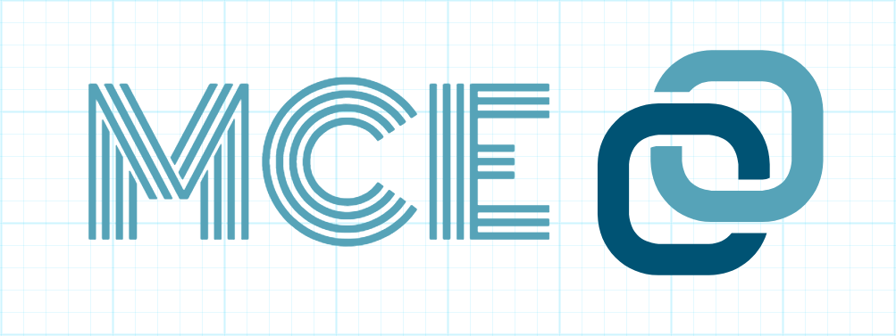

### This project has been deprecated. Please find more custom elements at https://github.com/allenhwkim/html-custom-elements

   

## Materialized Custom Element 

1. Small and fast.
2. No depenancy on framework or library. Vanilla JS only.
3. Common-sense engineering; Element itself(not JS object) has properties and functions.
4. Minimal coding, easy to maintain. Take a look at [code](https://github.com/allenhwkim/mce/blob/master/src/app-bar/app-bar.js)

[DEMO](https://rawgit.com/allenhwkim/mce/master/dist/)

It follows specification of
[custom element](https:/developer.mozilla.org/en-US/docs/Web/Web_Components/Custom_Elements)
and [material design](https:/material.io/guidelines/components/).

Articles
  * [Back To Element](https://medium.com/allenhwkim/back-to-element-c4aecf3c6b64)
  * [SPA Building with MCE](https://medium.com/allenhwkim/simple-spa-building-with-mce-f507e5f0236)

### Examples
#### mce-router
  You don't need Angular, React, or Vue to create a simple SPA with routing capability.
  [router example](https://mymce.github.io/mce-router.html)
   
#### mce-leaflet
  Do you want to show a map with marker and popup. 
  It's as easy as writing HTML with `<mce-leaflet>` tag.  
  [map example](https://mymce.github.io/mce-leaflet.html)
  [marker example](https://mymce.github.io/mce-marker.html)
    
#### mce-blocker
  Do you show a loading sign on a specific section. Use `mce-blocker` to show loading sign exactly overlayed on an element.
  [blocker example](https://mymce.github.io/mce-blocker.html) 

#### mce-inview
  Your page scrolls, and you don't want to load all elements that are not inviewport.
  [inview example](https://rawgit.com/allenhwkim/mce/master/dist/#inview)
   
#### mce-list-item
  You have list, and you want to click, navigate, select with keyboard/mouse.
  [list item example](https://rawgit.com/allenhwkim/mce/master/dist/#list-item)

## Installation
  
By simply adding the following `

**Optionally**, and for better design, you can add Google Roboto font, Material Design Icons, and/or, Font-Awesome icons.

    <link rel="stylesheet" href="https:/fonts.googleapis.com/css?family=Roboto:400,100,100italic,300,300ita‌​lic,400italic,500,500italic,700,700italic,900italic,900">
    <link rel="stylesheet" href="https:/fonts.googleapis.com/icon?family=Material+Icons">
    <link rel="stylesheet" href="https://unpkg.com/font-awesome@4.7.0/css/font-awesome.css">
    
## How To Use

Just use it in your html. No other step is required.

    <mce-text-field label="Simple"></mce-text-field>

## For Whom With Curiousity

    $ git clone  https://github.com/allenhwkim/mce.git
    $ cd mce
    $ npm i
    $ npm start # to see all components in development. mode

**For NodeJS users**, install `mce` package 

    npm install mce --save-dev
